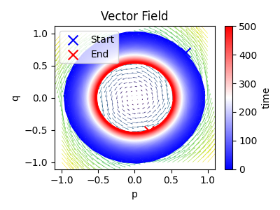
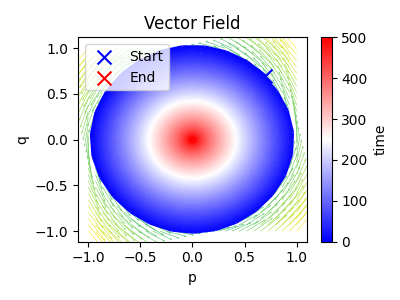
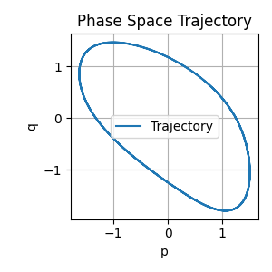
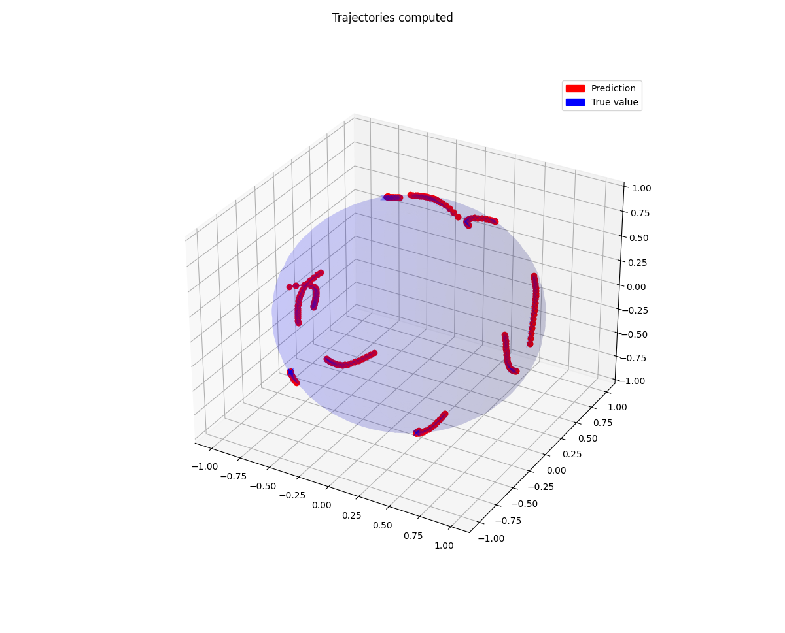

# HNNs
### Learning the vector field without any constraints.
##### Learned vector field

##### True vector field

### Introducing Hamiltonian neural networks to preserve the energy. 

### Integrating with manifold constraints ( on a sphere )

